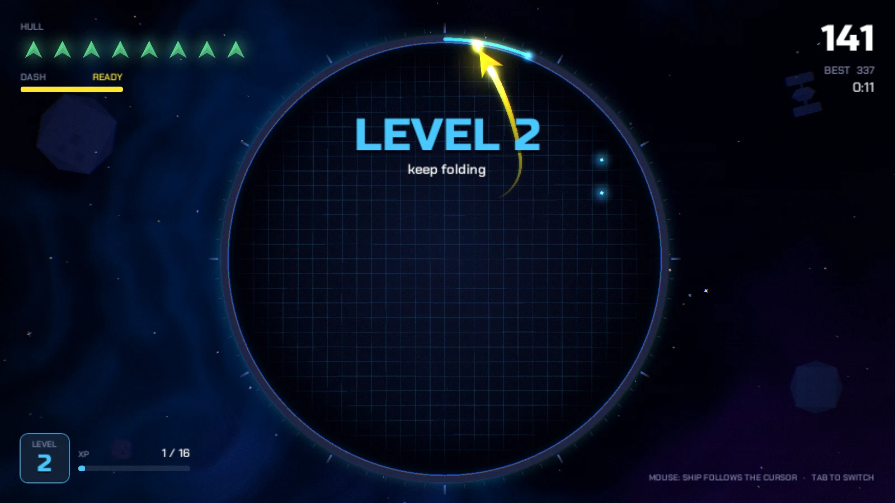

# Foldspace

A neon arcade survival game where you steer a ship, close loops with your trail, and chain attacks to chase a higher score.

[Play on itch.io](https://jaymehta721.itch.io/foldspace) · Developed by [Jay Mehta](https://jaymehta721.github.io/)

## Run locally

1. Add this project folder in Unity Hub and open it with **Unity 6000.3.15f1**.
2. Wait for packages to import, then open `Assets/Foldspace/Scenes/Game.unity`.
3. Press **Play**. The scenes and prefabs are already included.

## Controls

Mouse or A / D / arrows to steer, Space / Shift / right-click to dash, Tab to switch steering mode, Esc / P to pause.

## Credits

- Visuals and audio are generated procedurally in the game.
- Fonts: Russo One and Chakra Petch (SIL Open Font License); license notices are included with the fonts.

## License

Original project code is licensed under the [MIT License](LICENSE). Third-party assets and fonts retain their respective licenses; see the credits above and included license notices.
